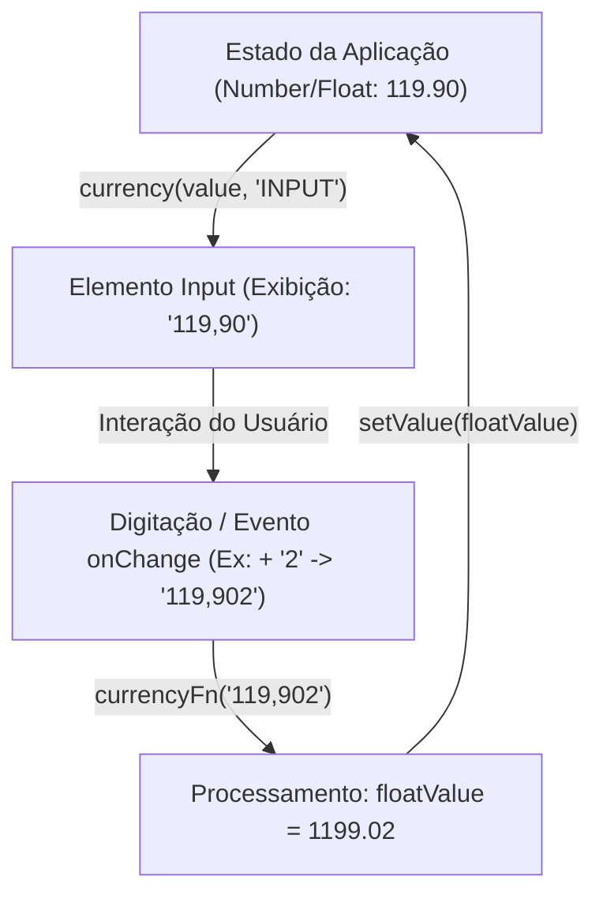

# Análise Detalhada: `make-currency` vs Formatação Nativa em JavaScript

Este documento apresenta uma análise técnica e de conceitos sobre a biblioteca **`make-currency`**, detalhando sua proposta de valor, decisões de arquitetura e uma comparação direta com as APIs nativas do JavaScript (`Intl.NumberFormat` e `toLocaleString`).

---

## 🎯 A Proposta Central da Biblioteca

Diferente de outras bibliotecas de manipulação de moedas que tentam interceptar e formatar diretamente o elemento do DOM (como diretivas ou seletores em inputs), a `make-currency` propõe uma abordagem **funcional, bidirecional e orientada a dados (data-driven)**.

A biblioteca funciona como um **facilitador de fluxo de dados** composto por duas funções principais e uma única fonte de verdade:

1. **Entrada (`number` -> `string`)**: Representada pela função `currency()`, que transforma um número real (Float) em uma string formatada para exibição.
2. **Saída (`string` -> `{ floatValue, stringValue }`)**: Representada pela função `currencyFn()`, que recebe qualquer string de entrada (como o evento de digitação do usuário) e a normaliza em um número limpo (Float) pronto para operações matemáticas ou persistência de dados.



---

## 🔍 Análise Comparativa: `make-currency` vs. APIs Nativas

A tabela abaixo compara a experiência de desenvolvimento e robustez técnica utilizando a `make-currency` em contraste com a formatação nativa:

| Critério / Funcionalidade       | `make-currency`                                                                                      | Formatação Nativa (`toLocaleString` / `Intl`)                                                           |
| :------------------------------ | :--------------------------------------------------------------------------------------------------- | :------------------------------------------------------------------------------------------------------ |
| **Suporte Bidirecional**        | **Nativo & Integrado**. Fornece parsing de strings de volta para floats via `currencyFn()`.          | **Inexistente**. Não há função nativa para fazer o parse reverso de strings formatadas.                 |
| **Normalização do Input**       | **Automática**. Gerencia preenchimento de zeros à esquerda e vírgulas dinâmicas.                     | **Manual**. Requer que o desenvolvedor crie expressões regulares complexas para limpar a string.        |
| **Consistência de Espaçamento** | **Garantida**. Normaliza espaços inquebráveis (`\u00A0`) para espaços normais (` `).                 | **Variável**. Diferentes navegadores/motores geram diferentes caracteres de espaçamento invisíveis.     |
| **Precisão de Arredondamento**  | **Estabilizada**. Garante truncamento e arredondamento seguro com a função interna `toNumber()`.     | **Inconsistente**. Pode apresentar problemas clássicos de ponto flutuante em JavaScript (`0.1 + 0.2`).  |
| **Configuração Global**         | **Sim**. Permite setar uma moeda padrão via `CONFIGURE()` uma única vez no bootstrap do app.         | **Não**. Requer passar a localidade e o objeto de opções em todas as chamadas.                          |
| **Suporte de Moedas (Locales)** | **139 moedas mapeadas**. Configurações prontas para uso, incluindo remoção de prefixos e símbolos.   | **Dinâmico**. Depende do suporte da API de `Intl` implementada na versão do browser/Runtime do usuário. |
| **Tratamento de Valor Zero**    | **Sim**. Opção `{ isEmpty: true }` retorna `""` em vez de formatar o zero (ideal para placeholders). | **Não**. Retorna sempre o valor formatado (ex: `"R$ 0,00"` ou `"$0.00"`).                               |

---

## ⚙️ Pipeline de Formatação e Contrato `TExchange`

A arquitetura interna da biblioteca define um pipeline rígido e previsível para todas as moedas mapeadas. Cada moeda segue o contrato `TExchange` que contém a localidade, o código ISO, funções de limpeza de prefixo (`removePrefix`) e opcionalmente modificação de símbolos (`replaceSymbol`).

O fluxo de processamento da função `currency()` ocorre da seguinte forma:

```
floatValue (ex: 1234.56)
  │
  ▼
Intl.NumberFormat(lang, { style: 'currency', currency }).format(floatValue)
  │
  ▼
Normalização de Espaço: .replace(/[\u00A0]/g, ' ') (converte espaço inquebrável para espaço comum)
  │
  ▼
replaceSymbol(value) [Opcional] (Swaps ou correções customizadas de símbolos)
  │
  ▼
┌───────────────────┴───────────────────┐
▼ (se symbol: true)                     ▼ (se symbol: false)
primaryPrice (ex: "R$ 1.234,56")         removePrefix(primaryPrice)
                                        │
                                        ▼
                                        formatValue (ex: "1.234,56")
```

### O Padrão Proxy Locale

Para moedas que possuem suporte limitado ou inconsistente em determinados motores JavaScript nativos, a biblioteca adota o padrão **Proxy Locale**. Um exemplo notável é o Yen Japonês (`JPY`), que utiliza as regras de formatação de `en-US` e `USD` internamente para garantir consistência e altera dinamicamente o símbolo usando `replaceSymbol`:

```ts
// Exemplo conceitual da configuração JPY
export default {
  lang: 'en-US',
  currency: 'USD',
  removePrefix: (value: string) => value.slice(1),
  replaceSymbol: (value: string) => value.replace('$', '¥')
} satisfies TExchange
```

---

## 🛠️ Conceitos Internos e Fluxo de Execução

### 1. O Modelo de Formatação: `currency`

A função `currency()` realiza a normalização do valor de ponto flutuante e delega a formatação para o `Intl.NumberFormat` nativo, corrigindo variações do motor do browser:

- **Arredondamento Seguro (`toNumber`)**:
  Para evitar erros de precisão do ponto flutuante do JavaScript, a biblioteca divide o número pela string de ponto decimal e limita o valor a no máximo duas casas decimais antes de convertê-lo de volta para `parseFloat`.
- **Substituição de Espaços e Remoção de Prefixos**:
  A lib substitui o caractere invisível `\u00A0` por um espaço comum. Se a opção `symbol: false` estiver ativa, utiliza a função utilitária `removePrefix` cadastrada individualmente para cada uma das 139 moedas para garantir um retorno numérico puro.

### 2. O Modelo de Evento: `currencyFn`

A função `currencyFn()` atua como o processador de strings do teclado do usuário. A lógica funciona assim:

1. **Entrada**: `'119,902'` (quando o usuário digita '2' ao final de um input formatado como `119,90`).
2. **Remoção de Não-Dígitos**: Remove todos os caracteres que não são números, resultando em `'119902'`.
3. **Casas Decimais Fixas**: Insere a vírgula/ponto decimal nas duas últimas posições usando regex: `currenctValue.replace(/(\d)(\d{2})$/, '$1,$2')` -> `'1199,02'`.
4. **Criação do Float**: Converte o valor para o padrão americano/JS (ponto flutuante) substituindo agrupadores e gerando o valor `1199.02`.
5. **Retorno Simultâneo**: Retorna o float resultante e a versão string formatada usando a moeda configurada.

---

## ⚡ Estabilidade do Cursor/Caret em Componentes Controlados

Um dos maiores problemas ao implementar máscaras de moeda tradicionais é a **perda da posição do cursor** (o cursor do teclado salta repentinamente para o fim do input após cada digitação). Isso ocorre porque a manipulação direta do valor do input intercepta o fluxo nativo do navegador de forma assíncrona ou destrutiva.

A `make-currency` resolve esse problema de forma elegante por meio de um design funcional puro:

1. **Estado Puro**: O estado interno do componente permanece como um float (`number`), que nunca armazena caracteres de máscara.
2. **Ciclo Síncrono de Renderização**: No evento `onChange`, o valor do input é lido como string, normalizado instantaneamente pela `currencyFn()`, e o novo Float é salvo no estado.
3. **Exibição Reformatada**: O input recebe de volta a string limpa reformatada de forma síncrona. Como a formatação apenas desloca os agrupamentos de milhares e decimais mantendo a ordem numérica linear dos caracteres, o cursor nativo do HTML se comporta de forma estável.

---

## 🎯 Por que usar a `make-currency`? (Pontos-Chave de Convencimento)

Se você está na dúvida entre usar a `make-currency`, criar uma solução própria com a API nativa ou adotar outra biblioteca do mercado, estes pontos mostram por que ela é a escolha ideal para o seu projeto:

### 1. Extrema Leveza e Zero Dependências (Apenas 1.6kB)

Com um tamanho de bundle de aproximadamente **1.6kB** (e menos de **800 bytes gzipped**), a biblioteca tem impacto praticamente nulo no carregamento da sua página. Ela atinge esse tamanho reduzido porque **reutiliza o motor de formatação nativo do navegador** (`Intl.NumberFormat`), em vez de recriar regras de internacionalização do zero. Tentar mapear manualmente as regras de formatação, símbolos e espaçamentos de **139 moedas** resultaria em um código muito maior e difícil de manter.

### 2. Arquitetura Agnóstica a Frameworks (Zero Efeitos Colaterais)

Muitas bibliotecas de máscara interceptam eventos de digitação diretamente no DOM por meio de referências (`refs`), seletores de classe ou diretivas customizadas. Isso gera conflitos severos com a reconciliação de estado de frameworks modernos como React, Vue e Svelte.

- A `make-currency` é uma biblioteca de **funções puras de Javascript**. Ela não toca no DOM.
- Funciona perfeitamente em aplicações React, Vue, Angular, Svelte, Javascript Vanilla e até mesmo no **Node.js (Backend)** e **React Native**.

### 3. Prevenção de Hydration Mismatch em SSR (Next.js / Nuxt)

A API nativa `Intl.NumberFormat` pode gerar caracteres invisíveis de espaçamento diferentes dependendo do navegador do usuário ou da versão do Node.js rodando no servidor (ex: espaços não-quebráveis `\u00A0` ou espaços finos `\u202F`). Em frameworks com Server-Side Rendering (SSR) como Next.js, isso gera o clássico erro de _Hydration Mismatch_ (quando o HTML gerado no servidor difere do cliente).

- A `make-currency` normaliza todos esses espaçamentos dinâmicos para um caractere de espaço comum (` `), garantindo que a renderização no servidor e no cliente seja **100% idêntica e livre de erros de hidratação**.

### 4. Modelo de Estado Limpo (Pronto para Bancos de Dados e APIs)

Manter strings formatadas (como `"R$ 1.250,00"`) no estado da sua aplicação é uma má prática de engenharia. Isso exige fazer o parse de texto toda vez que for necessário realizar um cálculo (ex: somar produtos no carrinho) ou enviar o dado para uma API/Banco de Dados.

- A `make-currency` propõe manter o estado como um **número decimal (`number`) puro**.
- Você só formata o dado no momento de renderizar a tela.
- Ao receber a digitação do usuário, o valor é imediatamente convertido em float. Isso mantém seus modelos de dados limpos, consistentes e prontos para persistência.

### 5. Tipagem TypeScript Estrita e Cobertura Total de Testes

Toda a biblioteca é escrita em TypeScript com suporte a tipagem estrita para todas as configurações de moeda. Além disso, ela conta com 100% de cobertura de testes unitários para garantir que nenhuma atualização quebre as regras matemáticas das moedas.

---

## 🎨 Exemplo Prático de Integração (React + TypeScript)

A integração em um componente controlado demonstra a simplicidade e a elegância da biblioteca:

```tsx
import React, { useState } from 'react'
import { currency, currencyFn, TYPES, CONFIGURE } from 'make-currency'

// 1. Configuração inicial (geralmente executada no bootstrap do app)
CONFIGURE({ money: TYPES.BRL })

export default function PriceInput() {
  // O estado do preço é mantido como um número float puro!
  const [price, setPrice] = useState<number>(0)

  return (
    <div
      style={{
        display: 'flex',
        flexDirection: 'column',
        gap: '8px',
        maxWidth: '300px'
      }}
    >
      <label htmlFor="price-field">Preço do Produto:</label>
      <input
        id="price-field"
        type="tel"
        // Exibe o preço formatado sem o símbolo (ex: "29,99"). Se for 0, exibe "" (mostrando o placeholder)
        value={currency(price, 'INPUT')}
        // Na alteração, converte a string digitada diretamente para o número float e atualiza o estado
        onChange={(e) => {
          const { floatValue } = currencyFn(e.currentTarget.value)
          setPrice(floatValue)
        }}
        placeholder="0,00"
        data-testid="product-price__input"
      />

      {/* Exibição final para o usuário com o símbolo da moeda (ex: "R$ 29,99") */}
      <p>
        Valor formatado para o carrinho: <strong>{currency(price)}</strong>
      </p>
    </div>
  )
}
```

---

## 🚀 Conclusão

A `make-currency` resolve de forma simples e extremamente leve um dos maiores problemas de interfaces de e-commerce e sistemas financeiros: **a disparidade entre o dado necessário no backend/banco de dados (Float/Number) e o dado exibido/digitado pelo usuário (String Formatada).**

Ao centralizar as particularidades de 139 moedas e fornecer o fluxo bidirecional e normalizado entre `currency()` e `currencyFn()`, ela se destaca como a solução mais robusta, performática e moderna para gerenciamento de moedas no ecossistema Javascript.
